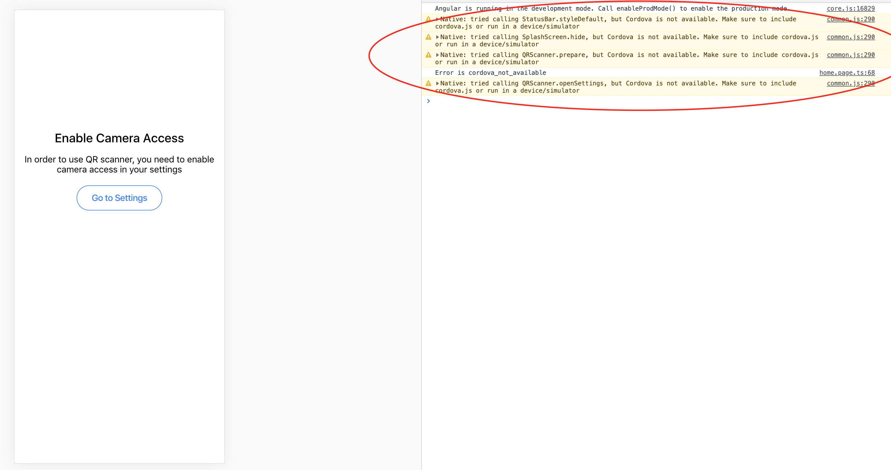
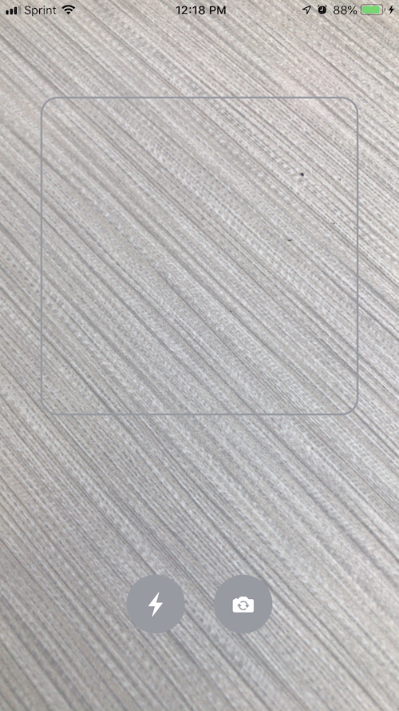
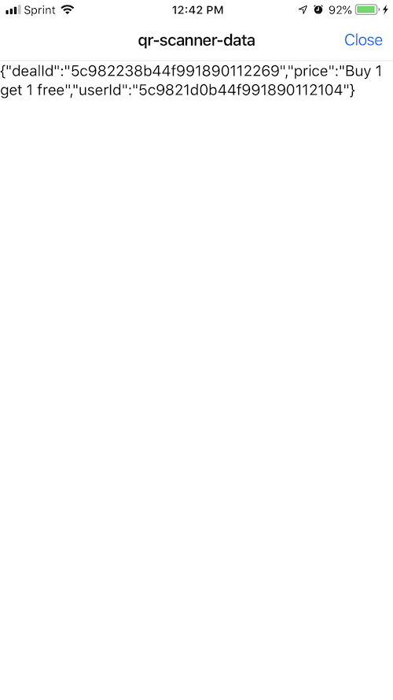

# QR Code Scanner in Ionic 4

In this tutorial, you will learn how to set up a QR code scanner in Ionic 4. 

I will assume that you know the basics of `Ionic 4`.

```
Note: Also, follow this tutorial in a separate project. This folder contains a working project.
```


## Run this folder
If you want to run this project folder. Clone this repo. Then run inside of the repo:

`npm i`

Then go to [Step 6](step6).


## Step 1: Set up
Open your terminal and go to the directory that you want to save this project under.

Let's create a blank Ionic project using this command below:

`ionic start ionic-qr-code-scanner`

`Ionic` might ask you whether you want install `AppFlow` for free. `AppFlow` is basically an Ionic service
that automates many things (You can read more about it [here](https://ionicframework.com/appflow)). 
For this tutorial, we do not need `AppFlow`. So, go ahead and type `no`.

Now, `ionic-qr-code-scanner` project should be now installed. Go to `ionic-qr-code-scanner` directory by:

`cd google-maps-tutorial`

Also, let's open this project in your favorite editors. These are the choices you can use:
* Sublime Text
* Atom
* Visual Studio Code
* Webstorm (it is free for students. this is my personal favorite :D )


## Step 2: Install Node and npm

To install all the plugins in this project, we will use `npm` which is a package manager. In order to use `npm`, you
need to install `Node.js`. You can install it through its website [here](https://nodejs.org/en/).

Run this in your terminal to check whether you have installed successfully:

`which node`

`which npm`

If the terminal prints out the location of those two commands, that means you have installed successfully.
If not, please see a TA for help.


## Step 3: Install QR Code Scanner Plugin

Go back to your terminal window. <b>Make sure you are in the project directory</b>.

To install QR Code Scanner plugins, we will run two commands:

```
ionic cordova plugin add cordova-plugin-qrscanner

npm install @ionic-native/qr-scanner
```


Open to your `./src/app/app.module.ts` file and import `QRScanner`.


```angular2
import { NgModule } from '@angular/core';
import { BrowserModule } from '@angular/platform-browser';
import { RouteReuseStrategy } from '@angular/router';

import { IonicModule, IonicRouteStrategy } from '@ionic/angular';
import { SplashScreen } from '@ionic-native/splash-screen/ngx';
import { StatusBar } from '@ionic-native/status-bar/ngx';

import { AppComponent } from './app.component';
import { AppRoutingModule } from './app-routing.module';

import { QRScanner } from '@ionic-native/qr-scanner/ngx';


@NgModule({
  declarations: [AppComponent],
  entryComponents: [],
  imports: [BrowserModule, IonicModule.forRoot(), AppRoutingModule],
  providers: [
    StatusBar,
    SplashScreen,
    QRScanner,
    { provide: RouteReuseStrategy, useClass: IonicRouteStrategy }
  ],
  bootstrap: [AppComponent]
})
export class AppModule {}
```


## Step 4: Create QR Code Scanner
We now will create a QR scanner in `home` page. Open `./src/app/home/home.page.ts`.

Import `QRScanner` and `QRScannerStatus` at the top of the file. `QRScannerStatus` is just an object that 
`QRScanner` returns. You will see how we use this later. Also, import `AlertController` to handle alerts.


```angular2
import {AlertController} from '@ionic/angular';
import { QRScanner, QRScannerStatus } from '@ionic-native/qr-scanner/ngx';
```

Create a `QRScanner` and `AlertController` objects in the `constructor`. You might not have the `constructor` when you create the project
in `home.page.ts`. Just write this inside the class:

```angular2
export class HomePage {
    constructor(
        private qrScanner: QRScanner,
        public alertController: AlertController
      ) {}
}
``` 

Now, let's write couple helper functions for our QR Scanner.


First, we will write `presentAlert()` and `presentAlertConfirm()` to handle error messages for the users: 

```angular2
async presentAlert(header, subHeader, message) {
    const alert = await this.alertController.create({
      header: header,
      subHeader: subHeader,
      message: message,
      buttons: ['OK']
    });
    
    await alert.present();
}
  
async presentAlertConfirm() {
  const alert = await this.alertController.create({
    header: 'Permission',
    message: 'Make sure you enable camera access in your settings in order to use QR Code scanner',
    buttons: [
      {
        text: 'Cancel',
        role: 'cancel',
        cssClass: 'secondary'
      }, {
        text: 'Go To Settings',
        handler: () => {
          this.openSettings();
        }
      }
    ]
  });

  await alert.present();
}
```


We will write a `startScanner()` function that will start our QR Scanner. Make sure you create a observable
class variable `scannerSub`. Also, `QRScannerStatus` is resolved by `prepare()`. 

```angular2
scannerSub;

// prepare and start scanner
startScanner() {
    this.qrScanner.prepare()
        .then((status: QRScannerStatus) => {
          if (status.authorized) {

            this.isOn = true;
            
            /* start scanning */
            this.scannerSub = this.qrScanner.scan().subscribe((data: any) => {
              console.log('QR Data', data);
              
              // start the scanner again after scanned, otherwise, the scanner will disable
              this.presentAlert('Data', '', data).then(() => {
                              this.startScanner();
                            });
            });
            this.qrScanner.show().then();


          } else if (status.denied) {
            // camera permission was permanently denied
            this.presentAlertConfirm().then();

          } else {
            // permission was denied, but not permanently. You can ask for permission again at a later time.
          }
        })
        .catch((e: any) => {
          console.log('Error is', e);

          if (e.code === 1) {
            this.presentAlertConfirm().then();
          } else {
            this.presentAlert('Alert', e.name, e._message).then();
          }
        });
 }
```

Now, let's finish the rest of the helpers. `isOn` variable is a flag that tells us whether QR scanner is on.
We will use this flag in the `html` template. `isLightOn` variable is a flag for flash light camera. `camera` variable
indicates whether it is front or back camera.

```angular2
isOn = false;
isLightOn = false;
camera = 0;
  
// stop scanner, but camera will be on
stopScanner() {
    this.isOn = false;
    this.qrScanner.hide().then();
    this.scannerSub.unsubscribe();
}

// destroy scanner when not in use
destroyScanner() {
    this.qrScanner.destroy().then();
}

// switch between front and back camera
reverseCamera() {
    this.camera = (this.camera === 0) ? 1 : 0;
    this.qrScanner.useCamera(this.camera).then();
}

// enable flash light
enableLight() {
    this.isLightOn = true;
    this.qrScanner.enableLight().then();
}

// disable flash light
disableLight() {
    this.isLightOn = false;
    this.qrScanner.disableLight().then();
}

// go to phone settings to set permissions
openSettings() {
    this.qrScanner.openSettings();
}
```


Now, we are gonna use something called `Ionic life cycle methods`. You can learn more about [here](https://medium.com/@paulstelzer/ionic-4-and-the-lifecycle-hooks-4fe9eabb2864).
We will use `ionViewWillEnter()` and `ionViewWillLeave()`.


```angular2
// called right before users enter the page
ionViewWillEnter() {
    this.startScanner();
}

// called right before users exit the page.
ionViewWillLeave() {
    this.stopScanner();
    this.destroyScanner();
}
```

When you are finished you should have:

```angular2
import { Component } from '@angular/core';
import {AlertController} from '@ionic/angular';


import { QRScanner, QRScannerStatus } from '@ionic-native/qr-scanner/ngx';

@Component({
  selector: 'app-home',
  templateUrl: 'home.page.html',
  styleUrls: ['home.page.scss'],
})
export class HomePage {

  isOn = false;
  scannerSub;

  isLightOn = false;
  camera = 0;

  constructor(
      public alertController: AlertController,
      private qrScanner: QRScanner,
  ) {}


  /**
   * ionic life cycle
   */
  ionViewWillEnter() {
    this.startScanner();
  }

  /**
   * ionic life cycle
   */
  ionViewWillLeave() {
    this.stopScanner();
    this.destroyScanner();
  }


  startScanner() {
    this.qrScanner.prepare()
        .then((status: QRScannerStatus) => {
          if (status.authorized) {
            
             this.isOn = true;

            /* start scanning */
            this.scannerSub = this.qrScanner.scan().subscribe((data: any) => {
              console.log('QR Data', data);
              this.presentAlert('Data', '', data).then(() => {
                              this.startScanner();
                            });
            });

            this.qrScanner.show().then();


          } else if (status.denied) {
            // camera permission was permanently denied
            this.presentAlertConfirm().then();

          } else {
            // permission was denied, but not permanently. You can ask for permission again at a later time.
          }
        })
        .catch((e: any) => {
          console.log('Error is', e);

          if (e.code === 1) {
            this.presentAlertConfirm().then();
          } else {
            this.presentAlert('Alert', e.name, e._message).then();
          }
        });
  }


  stopScanner() {
    this.isOn = false;
    this.qrScanner.hide().then();
    this.scannerSub.unsubscribe();
  }


  destroyScanner() {
    this.qrScanner.destroy().then();
  }


  reverseCamera() {
    this.camera = (this.camera === 0) ? 1 : 0;
    this.qrScanner.useCamera(this.camera).then();
  }


  enableLight() {
    this.isLightOn = true;
    this.qrScanner.enableLight().then();
  }


  disableLight() {
    this.isLightOn = false;
    this.qrScanner.disableLight().then();
  }


  openSettings() {
    /* go to phone settings */
    this.qrScanner.openSettings();
  }
  

  async presentAlertConfirm() {
    const alert = await this.alertController.create({
      header: 'Permission',
      message: 'Make sure you enable camera access in your settings in order to use QR Code scanner',
      buttons: [
        {
          text: 'Cancel',
          role: 'cancel',
          cssClass: 'secondary'
        }, {
          text: 'Go To Settings',
          handler: () => {
            this.openSettings();
          }
        }
      ]
    });

    await alert.present();
  }


  async presentAlert(header, subHeader, message) {
    const alert = await this.alertController.create({
      header: header,
      subHeader: subHeader,
      message: message,
      buttons: ['OK']
    });

    await alert.present();
  }
}
```


## Step 5: HTML and SCSS
Now, we will create buttons and a layer on top on the camera. I won't go into details. 
I think most of these are self-explanatory. Please let me know if you have questions.

Open `./src/app/home/home.page.html` and write: 

```angular2html
<ion-content padding [class.show-qr-scanner]="isOn">

  <div class="permission-access">
    <h3>Enable Camera Access</h3>

    <p>In order to use QR scanner, you need to enable camera access in your settings</p>

    <ion-button shape="round" fill="outline" (click)="openSettings()">
      Go to Settings
    </ion-button>
  </div>

</ion-content>


<div class="scanner-focus-icon" *ngIf="isOn">
  <div class="square"></div>
</div>


<div class="scanner-options" *ngIf="isOn">

  <ion-toolbar>

    <ion-button *ngIf="!isLightOn" (click)="enableLight()">
      <ion-icon slot="icon-only" name="flash"></ion-icon>
    </ion-button>

    <ion-button *ngIf="isLightOn" (click)="disableLight()">
      <ion-icon slot="icon-only" name="flash-off"></ion-icon>
    </ion-button>

    <ion-button (click)="reverseCamera()">
      <ion-icon slot="icon-only" name="reverse-camera"></ion-icon>
    </ion-button>

  </ion-toolbar>

</div>
```

Open `./src/app/home/home.page.scss` and write: 

```scss
.show-qr-scanner {
  display: none;
}

.permission-access {
  margin-top: 200px;
  text-align: center;
}

.scanner-focus-icon {
  position: fixed;
  width: 100%;
  height: 100%;
  text-align: center;

  .square {
    margin: 100px auto;
    border: 2px solid var(--ion-color-medium);
    border-radius: 18px;
    width: 330px;
    height: 330px;
    background: none;
  }
}


.scanner-options {
  position: fixed;
  bottom: 10%;
  width: 100%;
  text-align: center;

  ion-toolbar {
    --background: none;
  }

  ion-button {
    --background: var(--ion-color-medium);
    --border-radius: 50%;
    height: 3.8rem;
    margin: 4px 15px;
  }
}
```


## Step 6: Run Time :) <a name="step6"></a>

Since QR Scanner plugin will only work with native platforms, `ionic serve` will not work properly.
I mean you can try to run it. But you should see this:




So we will create native platforms to test it. I won't go into setting up native platforms since it is
a whole other tutorial. For now, I will refer you to `Ionic documentation`. If you have any questions,
please reach out to me. This might be a complicated process with all the Apple legal stuff.
I'm more than happy to help.

```
iOS: 
Set up: https://ionicframework.com/docs/installation/ios
Building (use ionic CLI): https://ionicframework.com/docs/building/ios#running-with-the-ionic-cli

Android:
Set up: https://ionicframework.com/docs/installation/android
Building (use Cordova): https://ionicframework.com/docs/building/android#running-with-cordova
```

When you have successfully build, you should see something like this:




## Step 7: Create a Modal (Extra)
Right now when you scan, you just get an alert. This might not be good when you have a lot of data to display.
What we can do is to create a modal when there is data.

Create a modal by:

```
ionic generate page modals/qr-scanner-data 
```

Go to `app.module.ts` and import the modal module:
```angular2
import { NgModule } from '@angular/core';
import { BrowserModule } from '@angular/platform-browser';
import { RouteReuseStrategy } from '@angular/router';

import { IonicModule, IonicRouteStrategy } from '@ionic/angular';
import { SplashScreen } from '@ionic-native/splash-screen/ngx';
import { StatusBar } from '@ionic-native/status-bar/ngx';

import { AppComponent } from './app.component';
import { AppRoutingModule } from './app-routing.module';

import { QRScanner } from '@ionic-native/qr-scanner/ngx';

import { QrScannerDataPageModule } from './modals/qr-scanner-data/qr-scanner-data.module';

@NgModule({
  declarations: [AppComponent],
  entryComponents: [],
  imports: [
    BrowserModule,
    IonicModule.forRoot(),
    AppRoutingModule,
    QrScannerDataPageModule
  ],
  providers: [
    StatusBar,
    SplashScreen,
    QRScanner,
    { provide: RouteReuseStrategy, useClass: IonicRouteStrategy }
  ],
  bootstrap: [AppComponent]
})
export class AppModule {}

```


Go to `home.page.ts` and import `ModalController`

```angular2
import {AlertController, ModalController} from '@ionic/angular';
import {QrScannerDataPage} from '../modals/qr-scanner-data/qr-scanner-data.page';

constructor(
  public alertController: AlertController,
  private qrScanner: QRScanner,
  public modalController: ModalController
) {}

startScanner() {
   ...

   /* start scanning */
   this.scannerSub = this.qrScanner.scan().subscribe((data: any) => {
     console.log('QR Data', data);
     
     // open modal
     this.presentModal(data).then();
   });

   this.qrScanner.show().then();
   ...
}
      
                 */
  async presentModal(qrData) {
    // open modal and pass data to it 
    const modal = await this.modalController.create({
      component: QrScannerDataPage,
      componentProps: { qrCodeData: qrData }
    });

    this.disableLight();
    
    await modal.present();

    /* restart scanner after modal is dismiss */
    /* wait until modal is closed */
    const { data } = await modal.onDidDismiss();

    this.startScanner();
  }
```


``
Note: as you leave the page and go to the modal, ionViewWillLeave() will be called and destroy the scanner.
If you do not have this, the scanner will continue to scan in the background.
``

Now, when you scan a QR code, a modal will pop up. Now, we will add stuff inside the modal. 

Go to `./src/app/modals/qr-scanner-data.page.ts`. Write:


```angular2
import {Component, Input, OnInit} from '@angular/core';
import {ModalController, NavParams} from '@ionic/angular';

@Component({
  selector: 'app-qr-scanner-data',
  templateUrl: './qr-scanner-data.page.html',
  styleUrls: ['./qr-scanner-data.page.scss'],
})
export class QrScannerDataPage implements OnInit {

  @Input() qrCodeData: any;

  constructor(
      private navParams: NavParams,
      public modalController: ModalController,
  ) { }


  ngOnInit() {
    // get data that was passed by the main page
    this.qrCodeData = this.navParams.get('qrCodeData');
  }


  // close modal and pass any data back
  async closeModal(data) {
    return await this.modalController.dismiss(data);
  }
}
```

Open `qr-scanner-data.html`. Write:

```angular2html
<ion-header>
  <ion-toolbar>
    <ion-title>qr-scanner-data</ion-title>

    <ion-buttons slot="end">
      <ion-button (click)="closeModal(null).then()">
        Close
      </ion-button>
    </ion-buttons>
  </ion-toolbar>
</ion-header>

<ion-content>
  {{qrCodeData}}
</ion-content>

```


Now, run again and you should see something like this:




## Conclusion:
As you go through this tutorial, if you see any mistakes, please feel free to let me know.

If you have any questions, feel free to reach out. 

I hope you find this helpful. :) 


